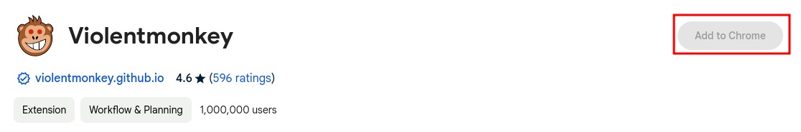
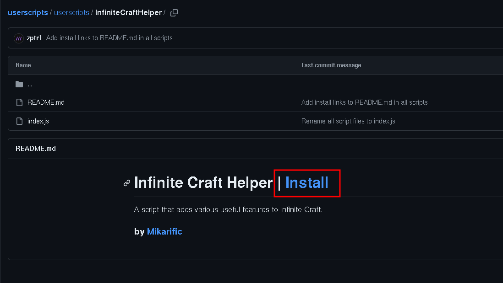
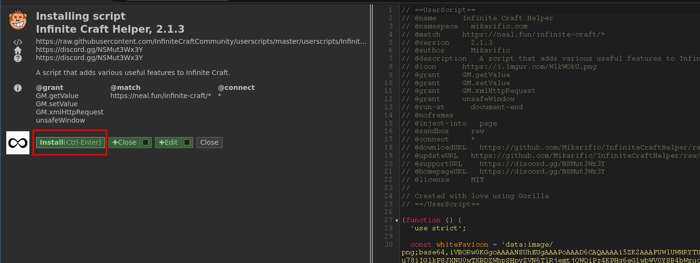

# User Scripts

A collection of community-made user scripts for [Infinite Craft](https://neal.fun/infinite-craft).

## ✨ Popular Userscripts

- [MBS](userscripts/MBS) - adds even more useful features to Infinite Craft
- [Infinite Craft Helper](userscripts/InfiniteCraftHelper) - adds useful features to Infinite Craft
- [BetterRandomButton](userscripts/BetterRandomButton) - a better Random Element Button
- [gm_abuse](userscripts/gm_abuse) - moves your savefile to the script's storage, allowing bigger savefiles to be used
- [AdjustInfiniBrowserLineages](userscripts/AdjustInfiniBrowserLineages/) - adjusts lineages on InfiniBrowser, removing steps for elements that you already have
- [TextOnBoard](userscripts/TextOnBoard) - allows you to write text messages on the board

## How to install a userscript?

1. Install a monkey. I recommend using [Violentmonkey](https://violentmonkey.github.io/get-it/).
   
2. Go to the userscript you want to install in the repository, and click "Install":
   
3. This should open a separate menu to install a script. Click "Install" and you're done!
   
