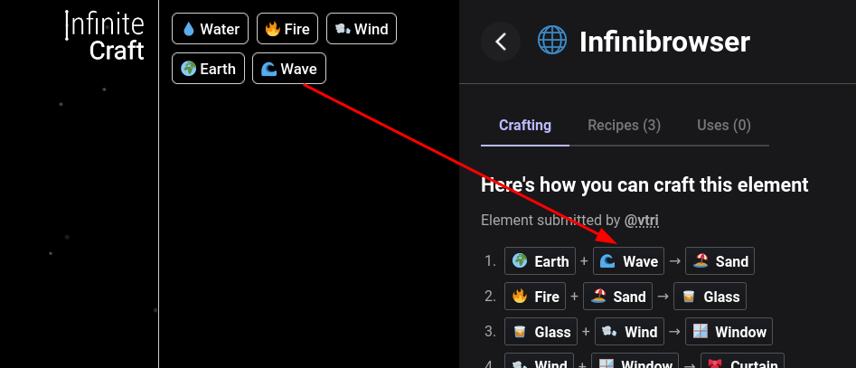

# Adjust InfiniBrowser Lineages | [Install](https://raw.githubusercontent.com/InfiniteCraftCommunity/userscripts/master/userscripts/AdjustInfiniBrowserLineages/index.user.js)

Adjust lineages on InfiniBrowser, removing steps for elements that you already have on Infinite Craft

Also removes the "the recipe for this element might be too big" message on the search page.

### by [zeroptr](https://github.com/zptr1)
